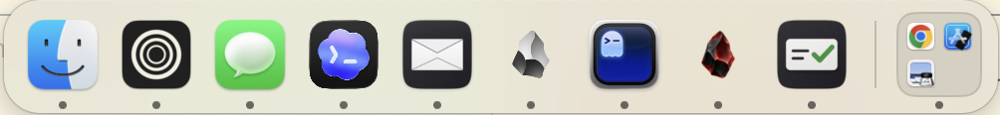

# Frosty

A Dock replacement for macOS that keeps the clutter in groups, the way Ice keeps
the menu bar tidy. Swift/AppKit + SwiftUI, macOS 14+, no special permissions.

It hides the real Dock by setting it to auto-hide with a 1000-second reveal delay,
then draws its own bar at the bottom of the main display.



## Requirements and install

macOS 14 (Sonoma) or later, Xcode 16+, and [XcodeGen](https://github.com/yonaskolb/XcodeGen)
(`brew install xcodegen`). There is no prebuilt release yet; build it:

```sh
git clone https://github.com/cxrobx/frosty.git && cd frosty
xcodegen generate
xcodebuild -project Frosty.xcodeproj -scheme Frosty -configuration Release -derivedDataPath build build
cp -R build/Build/Products/Release/Frosty.app /Applications/
open /Applications/Frosty.app
```

The build is ad-hoc signed, so the first launch may need right-click → Open.

Badges and each app's own right-click menu are read from the real Dock, so they need
Accessibility access (Frosty's menu → Allow Accessibility). macOS ties that grant to an
ad-hoc build, so it is lost on every rebuild. `scripts/install.sh` builds, installs and,
with `FROSTY_SIGN_IDENTITY` set to one of your signing identities, re-signs the app so
the grant sticks. On a managed Mac where `/Applications` is locked, set
`FROSTY_APP_DIR=~/Applications`.

If badges vanish after a rebuild, the old grant is stale. Toggling Frosty off and on in
System Settings → Privacy & Security → Accessibility does nothing, even though the entry
still looks enabled. Remove Frosty from the list with **−**, then add it again with **+**
(or use Allow Accessibility from Frosty's menu).

**Known limit:** App Exposé and Mission Control always bring the real Dock up.
That is macOS, not a setting; every Dock replacement shares it.

## If the Dock ever stays hidden

Quitting Frosty from its ❄︎ menu-bar icon, `kill`, Ctrl-C and logging out all put
the original Dock settings back. A hard crash can't, so the originals wait in
`~/Library/Application Support/Frosty/dock-original.json` and are restored on the
next launch-and-quit. To bring the Dock back by hand:

```sh
defaults delete com.apple.dock autohide-delay; killall Dock
# and, if your Dock did not auto-hide before Frosty:
defaults write com.apple.dock autohide -bool false; killall Dock
```

## Build, test, run

```sh
xcodegen generate
xcodebuild -project Frosty.xcodeproj -scheme Frosty -derivedDataPath build test
open build/Build/Products/Debug/Frosty.app
```

The test target is deliberately not hosted by the app: a hosted run would launch
Frosty and hide the Dock. It compiles `Frosty/Model/` directly instead.

## Using it

- **Bar:** placed apps in config order, then a separator, then running apps that
  aren't placed. Two or more of those collect into one **Open Apps** group (turn
  off with *Group Unpinned Apps* in the ❄︎ menu, or `"groupUnpinned": false`).
  An app inside a group never appears loose; the group's dot lights up.
- **Right-click a running app:** the app's own Dock menu (New Message, recent files,
  Options…), over its tile. macOS only opens that menu over the hidden real Dock's
  icon, so the first time you right-click an app Frosty opens it there for a
  moment, copies it and closes it, then draws its copy (saved across restarts). The copy updates
  only when you pick one of the app's own items, so a window list or recent
  files can be out of date until then.
  **Always-Fresh App Menus** (❄︎ menu, off by default) takes a fresh copy on every
  right-click instead, hiding the real menu under a still of the screen for about
  a third of a second. It needs Screen Recording, and the menu opens ~150 ms after
  the click rather than at once. Picking an app-specific
  item flashes the real menu at the bottom of the screen for a moment.
- **Option-right-click an app** (or right-click one that isn't running): Hide · Quit ·
  Keep in / Remove from Frosty · Move to Group (existing or New Group…) · Remove
  from group · Show in Finder.
- **Right-click a group:** Rename… · Ungroup.
- **Resize:** drag the divider up or down, as in the real Dock, or use the Icon
  Size slider in the ❄︎ menu (the bar stays up while the menu is open). 16–128 pt.
- **Other displays:** push the pointer against the bottom edge of any display and
  the bar moves there, as the real Dock does. It remembers that display across
  restarts (`"display"` in the config); while it is unplugged the bar waits on the
  main display.
- **Menu-bar ❄︎:** Hide the Real Dock · Auto-hide Frosty · Group Unpinned Apps · Icon Size · Edit Config… · Reload
  Config · Quit.

## Config

`~/Library/Application Support/Frosty/config.json`, seeded on first launch from
the real Dock's pinned apps:

```json
{ "autoHide": true, "iconSize": 48,
  "items": [ { "app": "com.apple.finder" },
             { "group": "Notes", "apps": ["com.apple.Notes", "md.obsidian"] } ],
  "icons": { "md.obsidian": "~/Library/Application Support/obsidian/icon.png" } }
```

`icons` (optional) swaps an app's icon for any image file. Use it for apps that
change their Dock icon at runtime, like Obsidian's *Appearance → App icon*: that
swap reaches only the Dock, and every public API still returns the icon inside
the `.app`.

Edit it, then choose Reload Config. Reordering is done here for now; there is no
drag-to-reorder yet.

## Layout

| Path | What |
|---|---|
| `Frosty/Model/` | Pure logic, unit-tested: config format + edits, bar layout, Dock hide/restore |
| `Frosty/System/` | Live Dock prefs, app lookup/launching, the observable model |
| `Frosty/UI/` | Bar panel + auto-hide controller, SwiftUI tiles, group grid |

## Not built (yet)

No drag-and-drop onto icons · no badges · no window previews ·
no launch at login. Minimize, Mission Control and Cmd-Tab still use Apple's hidden
Dock, which no third-party bar can take over.

## License

[MIT](LICENSE)
