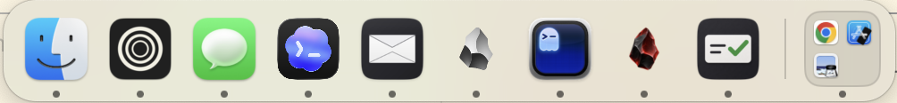

# Frosty

A Dock replacement for macOS that keeps the clutter in groups, the way Ice keeps
the menu bar tidy. Swift/AppKit + SwiftUI, macOS 14+, no special permissions.

It hides the real Dock by setting it to auto-hide with a 1000-second reveal delay,
then draws its own bar at the bottom of the main display.



## Install

Requires macOS 14 (Sonoma) or later.

1. Download `Frosty-X.Y.Z-macOS.dmg` from the
   [latest release](https://github.com/cxrobx/frosty/releases/latest).
2. Open it and drag **Frosty** onto **Applications**, then launch it.

Releases are signed with a Developer ID and notarized by Apple, so macOS opens them
without a warning. Frosty then updates itself: it checks for a new release once a day,
asks before installing one, and relaunches into the new version. **Check for Updates…** in
the ❄︎ menu checks right away. Each update is signed with an EdDSA key that only the
maintainer holds, and Frosty refuses any archive that doesn't verify.

### First launch: permissions

Badges and each app's own right-click menu are read from the real Dock, so they need
**Accessibility** (Frosty's menu → Allow Accessibility). **Always-Fresh App Menus**
(off by default) also needs **Screen Recording**; macOS asks when you turn it on.
Grants stick across updates, because every release is signed with the same Developer ID.

If badges vanish after an update or a rebuild, the old grant is stale. Toggling Frosty off and on in
System Settings → Privacy & Security → Accessibility does nothing, even though the entry
still looks enabled. Remove Frosty from the list with **−**, then add it again with **+**
(or use Allow Accessibility from Frosty's menu).

### Build from source

Needs Xcode 16+ and [XcodeGen](https://github.com/yonaskolb/XcodeGen)
(`brew install xcodegen`). `scripts/install.sh` builds a Release copy, installs it into
`/Applications` and re-signs it with the first Apple Development identity in your
keychain, so the Accessibility grant survives rebuilds (set `FROSTY_SIGN_IDENTITY` to pick
another, or `-` to stay ad-hoc; on a managed Mac where `/Applications` is locked, set
`FROSTY_APP_DIR=~/Applications`).

```sh
git clone https://github.com/cxrobx/frosty.git && cd frosty
scripts/install.sh
```

Or by hand:

```sh
xcodegen generate
xcodebuild -project Frosty.xcodeproj -scheme Frosty -configuration Release -derivedDataPath build build
cp -R build/Build/Products/Release/Frosty.app /Applications/
open /Applications/Frosty.app
```

A plain build is ad-hoc signed, so the first launch may need right-click → Open, and
macOS ties its Accessibility grant to that exact build. A source build checks the same
update feed as a release.

**Known limit:** App Exposé and Mission Control always bring the real Dock up.
That is macOS, not a setting; every Dock replacement shares it.

## If the Dock ever stays hidden

Quitting Frosty from its ❄︎ menu-bar icon, `kill`, Ctrl-C and logging out all put
the original Dock settings back. A hard crash can't, so the originals wait in
`~/Library/Application Support/Frosty/dock-original.json` and are restored on the
next launch-and-quit. To bring the Dock back by hand:

```sh
defaults delete com.apple.dock autohide-delay; killall Dock
# and, if your Dock did not auto-hide before Frosty:
defaults write com.apple.dock autohide -bool false; killall Dock
```

## Build, test, run

```sh
xcodegen generate
xcodebuild -project Frosty.xcodeproj -scheme Frosty -derivedDataPath build test
open build/Build/Products/Debug/Frosty.app
```

The test target is deliberately not hosted by the app: a hosted run would launch
Frosty and hide the Dock. It compiles `Frosty/Model/` directly instead.

## Releasing

For the maintainer. A release is built, notarized and staged locally; publishing is one
deliberate command.

1. In `project.yml`, bump `MARKETING_VERSION` (what people read, `0.1.1`) **and**
   `CURRENT_PROJECT_VERSION` (an integer, `2`). Sparkle offers an update only when the
   build number is higher than the installed one, so it must rise with every release;
   the script refuses a number that has not gone above every earlier tag's. Commit.
2. `scripts/release.sh 0.1.1` refuses a dirty tree, an existing `v0.1.1` tag or release, or a
   version that doesn't match `project.yml`. It archives, exports with Developer ID,
   notarizes and staples the app, builds the zip Sparkle installs from and the DMG people
   download (both with `.sha256` files), signs the zip with the EdDSA key and writes
   `appcast.xml`, all into `dist/0.1.1/`, then verifies the result and prints the exact
   `gh release create …` command. It never publishes unless given `--publish`.
   `scripts/release.sh 0.1.1 --check` runs only those refusals and the signing-key,
   identity and notary checks, then stops: a dry run that builds nothing.
3. Push the commit, run that command, then `scripts/verify-update-feed.sh` to check the
   live feed. `verify-update-feed.sh dist/0.1.1` checks a staged release before it is live.

The EdDSA private key lives in the login Keychain (account `frosty`) with a copy in the
secret `SPARKLE_ED_PRIVATE_FROSTY`. Lose both and installed copies can never be updated.
The public half is `SUPublicEDKey` in `Frosty/App/Info.plist`; don't change it.

## Using it

- **Launch at Login:** enable it in the ❄︎ menu to open Frosty automatically when
  you sign in, including after restarting your Mac. It is off until you enable it.
  macOS remembers the setting across launches; turn it off in the same menu to
  stop automatic launches. If macOS needs approval, the item shows a dash and
  **Allow Launch at Login in System Settings…** takes you to Login Items to enable
  Frosty. The menu also reflects changes made in System Settings.
- **Bar:** placed apps in config order, then a separator, then running apps that
  aren't placed. Two or more of those collect into one **Open Apps** group (turn
  off with *Group Unpinned Apps* in the ❄︎ menu, or `"groupUnpinned": false`).
  An app inside a group never appears loose; the group's dot lights up.
- **Stash:** Move to Group › Open Apps (or drag an app onto the Open Apps box)
  keeps it in that box even after it quits (no dot), one click from
  launching. A stash shows the box even when nothing else is open. Remove from
  “Open Apps”, Keep in Frosty, or moving it to a group takes it back out
  (`"stash"` in the config).
- **Right-click a running app:** the app's own Dock menu (New Message, recent files,
  Options…), over its tile. macOS only opens that menu over the hidden real Dock's
  icon, so the first time you right-click an app Frosty opens it there for a
  moment, copies it and closes it, then draws its copy (saved across restarts). The copy updates
  only when you pick one of the app's own items, so a window list or recent
  files can be out of date until then.
  **Always-Fresh App Menus** (❄︎ menu, off by default) takes a fresh copy on every
  right-click instead, hiding the real menu under a still of the screen for about
  a third of a second. It needs Screen Recording, and the menu opens ~150 ms after
  the click rather than at once. Picking an app-specific
  item flashes the real menu at the bottom of the screen for a moment.
- **Option-right-click an app** (or right-click one that isn't running): Hide · Quit ·
  Keep in / Remove from Frosty · Move to Group (existing, Open Apps, or New Group…) ·
  Remove from group · Show in Finder.
- **Right-click a group:** Rename… · Ungroup.
- **Resize:** drag the divider up or down, as in the real Dock, or use the Icon
  Size slider in the ❄︎ menu (the bar stays up while the menu is open). 16–128 pt.
- **Other displays:** push the pointer against the bottom edge of any display and
  the bar moves there, as the real Dock does. It remembers that display across
  restarts (`"display"` in the config); while it is unplugged the bar waits on the
  main display.
- **Menu-bar ❄︎:** Launch at Login · Hide the Real Dock · Auto-hide Frosty · Group Unpinned Apps · Icon Size · Edit Config… · Reload
  Config · Quit.

## Config

`~/Library/Application Support/Frosty/config.json`, seeded on first launch from
the real Dock's pinned apps:

```json
{ "autoHide": true, "iconSize": 48,
  "items": [ { "app": "com.apple.finder" },
             { "group": "Notes", "apps": ["com.apple.Notes", "md.obsidian"] } ],
  "icons": { "md.obsidian": "~/Library/Application Support/obsidian/icon.png" } }
```

`icons` (optional) swaps an app's icon for any image file. Use it for apps that
change their Dock icon at runtime, like Obsidian's *Appearance → App icon*: that
swap reaches only the Dock, and every public API still returns the icon inside
the `.app`.

Edit it, then choose Reload Config. Reordering is done here for now; there is no
drag-to-reorder yet.

## Layout

| Path | What |
|---|---|
| `Frosty/Model/` | Pure logic, unit-tested: config format + edits, bar layout, Dock hide/restore |
| `Frosty/System/` | Live Dock prefs, app lookup/launching, the observable model |
| `Frosty/UI/` | Bar panel + auto-hide controller, SwiftUI tiles, group grid |

## Not built (yet)

No drag-and-drop onto icons · no badges · no window previews.
Minimize, Mission Control and Cmd-Tab still use Apple's hidden
Dock, which no third-party bar can take over.

## License

[Business Source License 1.1](LICENSE), © 2026 CX Ventures LLC. The source is
available and you may use it personally or inside your own organisation.
Selling it, hosting it for others or bundling it into a commercial product
needs a commercial licence. Each version becomes Apache-2.0 on 2030-09-30 or
four years after its release, whichever comes first.
Versions published before 2026-09-30 were released under the MIT licence.
